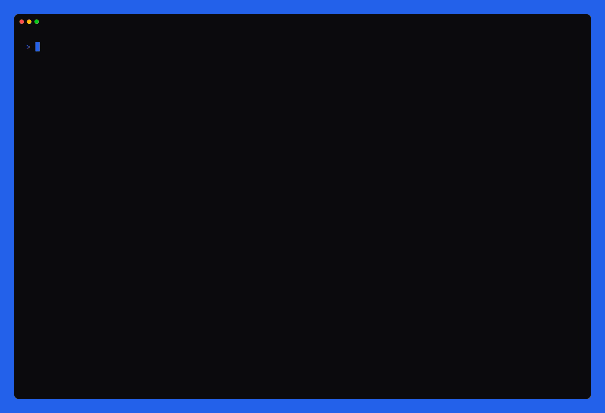

<div align="center">


An interactive CLI that scaffolds an opinionated, production-ready **Next.js 16 · React 19 · TypeScript** project — and leaves you in a formatted, linted, git-initialized app that runs on the first try.

[](https://github.com/maurice-rm/next-suite/releases)
[](https://www.npmjs.com/package/create-next-suite)
[](https://www.npmjs.com/package/create-next-suite)
[](https://nodejs.org)
[](LICENSE)

</div>

---

> **⚠️ Beta** — this is a pre-1.0 release; flags and generated output may still change before a stable 1.0.0.

## 🚀 Quick start

```bash
npm create next-suite@latest my-app
# or:  pnpm create next-suite@latest my-app  ·  yarn create next-suite@latest my-app  ·  bun create next-suite@latest my-app
```

While the package is in beta, `@latest` is required — a bare name resolves to the semver range `*`, which excludes prereleases like the current `1.0.0-beta.x`. Drop it once `1.0.0` ships.

Answer the guided wizard — it has back-navigation, so there's nothing to memorize — and you land in a ready-to-run project. Prefer a scripted run? Every choice is also a flag (see [Non-interactive](#-non-interactive--ci)).

## 🧩 What you get

**Core** — in every project

- ⚡ **Next 16 · React 19 · TypeScript (strict)** — App Router, React Compiler, `@/*` alias
- 🧰 **DX toolchain** — ESLint · Prettier · Husky · commitlint · typed env

**Optional** — pick in the wizard

- 🎨 **Tailwind + shadcn/ui**
- 🗄️ **Database** — Postgres / MySQL · Drizzle / Prisma
- 🔌 **API** — tRPC / oRPC + TanStack Query · optional OpenAPI + Scalar
- 🔐 **Better-Auth** · ✉️ **Resend**
- 🐳 **Production** — Docker + nginx · 🤖 **CI/CD** — GitHub Actions

<details>
<summary><b>Full feature details</b></summary>

<br>

- **Next.js 16 · React 19 · TypeScript (strict)** — App Router, the React Compiler enabled, `@/*` path alias, `noUncheckedIndexedAccess`.
- **ESLint** (flat config) — Next core-web-vitals + TypeScript presets, `simple-import-sort`, import-hygiene rules, kept Prettier-compatible.
- **Prettier** — with `prettier-plugin-packagejson`.
- **Git hooks** — Husky + `lint-staged` + commitlint (Conventional Commits).
- **Typed environment variables** — `@/env` via `@t3-oss/env-nextjs` + `zod`, validated at startup; features add their vars automatically.
- **EditorConfig, `.gitattributes`, `.nvmrc`**, and your choice of **npm / pnpm / yarn / bun**.
- **Tailwind CSS + shadcn/ui** (optional) — Tailwind v4 wiring plus the shadcn init flow (base, preset, pointer).
- **Local database** (optional) — a dockerized **PostgreSQL** or **MySQL** with **Drizzle** or **Prisma**: `POSTGRES_*`/`MYSQL_*` env vars, `db:*` scripts, client generation on install.
- **API layer** (optional) — **tRPC** or **oRPC** with **TanStack Query**, RSC prefetching + hydration, a health route; oRPC can add an **OpenAPI (REST)** layer with an optional **Scalar** docs UI.
- **Auth** (optional) — **Better-Auth** (email + password), headless: schema tables per ORM, `/api/auth` handler, typed `getSession`, the session in the API context.
- **Email** (optional) — a **Resend** client with `EMAIL_FROM`, wired through the typed env.
- **Production deployment** (optional) — a multi-stage **Docker** build (standalone), **nginx** (terminating TLS or behind an upstream proxy), a `docker-compose.prod.yml`, and an entrypoint that waits for the database and migrates on start. For proxied projects, the companion `next-suite provision` command _(beta)_ sets up the server over SSH (interactive wizard, `--yes` for CI); `next-suite deprovision` tears it back down.
- **CI/CD** (optional) — **GitHub Actions**: CI (lint, type-check, format, build) plus CD (build & push to GHCR, deploy over SSH).

After generation it can, depending on your answers: **initialize git** (on `main`), **install dependencies**, **auto-format**, and make an **initial commit** — a clean, formatted, committed start.

</details>

## 🎬 Preview



<sub>Re-record with <code>vhs assets/demo.tape</code> after changing the wizard.</sub>

## 🧑‍💻 Non-interactive / CI

Pass `--yes` to build from flags and defaults with no prompts:

```bash
npx create-next-suite@latest my-app --yes --pm pnpm --tailwind \
  --database postgres --orm drizzle --auth better-auth
```

Every wizard choice is also a flag. The **[CLI reference](docs/cli-reference.md)** lists all of them with their real defaults, plus every `--yes` validation rule, every wizard step, and the exit codes. `create-next-suite --help` prints the short form.

## 📋 Requirements

**Node.js ≥ 24** · a package manager (npm / pnpm / yarn / bun) · **git** (for the initial commit) · **Docker** (only for the database and production features).

For `next-suite provision`: an **`ssh` client with `ssh-keygen`**, and the **GitHub CLI `gh`** authenticated — or `--skip-github`.

## 🛰️ Server provisioning (beta)

For proxied projects, `next-suite provision` / `deprovision` set up and tear down the server over SSH — new and experimental, run `--dry-run` first. It installs nothing; see [Server requirements](docs/server-requirements.md) for what the server needs first, and [Provisioning](docs/provisioning.md) for the full workflow.

## 📚 Documentation

| Document                                           | What it covers                                            |
| -------------------------------------------------- | --------------------------------------------------------- |
| [CLI reference](docs/cli-reference.md)             | Every flag, every wizard step, exit codes                 |
| [The generated project](docs/generated-project.md) | File tree, packages, scripts, env vars, `next-suite.json` |
| [Provisioning](docs/provisioning.md)               | `provision` / `deprovision` / `config`, step by step      |
| [Server requirements](docs/server-requirements.md) | What a server needs before `provision` runs               |
| [Troubleshooting](docs/troubleshooting.md)         | Symptom → cause → fix                                     |
| [Architecture](docs/architecture.md)               | Monorepo, two-phase flow, layering, generation pipeline   |

Start at the [documentation index](docs/README.md). Release history is in the [changelog](packages/cli/CHANGELOG.md).

## 🏗️ Development

A Turborepo monorepo; the product is the CLI in [`packages/cli`](packages/cli).

```bash
pnpm build                             # build everything (turbo)
pnpm check-types                       # type-check
pnpm lint                              # lint
pnpm test                              # tests (vitest)
pnpm cli                               # build the CLI and run it end-to-end
```

See **[CONTRIBUTING.md](CONTRIBUTING.md)** to get set up and **[docs/architecture.md](docs/architecture.md)** for how the CLI is put together. Conventions and extension points for coding agents live in [`packages/cli/AGENTS.md`](packages/cli/AGENTS.md). Security policy: [SECURITY.md](SECURITY.md).

## 📄 License

MIT © [Maurice Reim](https://github.com/maurice-rm)
