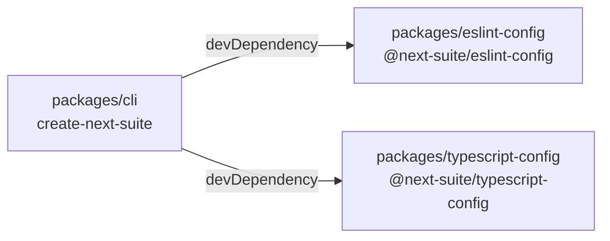
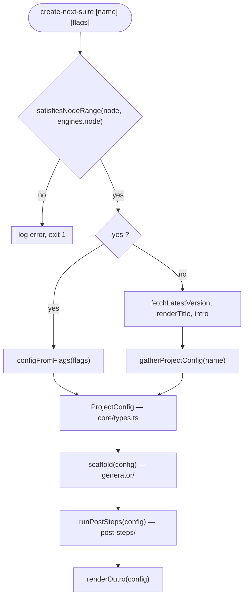

# Architecture

This document explains how the repository is put together, for people who work on the code. It describes what the code does today, not what it should do.

The agent-facing rulebook — conventions, extension points, the bar a change must clear — lives in [`packages/cli/AGENTS.md`](../packages/cli/AGENTS.md). This document does not replace it.

## The monorepo

The repository is a pnpm workspace (`pnpm-workspace.yaml` globs `packages/*`) driven by turbo (`turbo.json`). It holds three packages, but only one of them is the product.

| Package                      | Name                            | Published | Role                                                                      |
| ---------------------------- | ------------------------------- | --------- | ------------------------------------------------------------------------- |
| `packages/cli`               | `create-next-suite`             | yes       | The product: an interactive Next.js scaffolder plus a `next-suite` binary |
| `packages/eslint-config`     | `@next-suite/eslint-config`     | no        | Shared flat ESLint config, `private: true`                                |
| `packages/typescript-config` | `@next-suite/typescript-config` | no        | Shared `tsconfig` base, `private: true`                                   |

The two config packages are reduced `create-turbo` leftovers. They are consumed by exactly one consumer, the CLI, and only as devDependencies:

- `packages/cli/eslint.config.js` imports `{ config }` from `@next-suite/eslint-config/base`.
- `packages/cli/tsconfig.json` sets `"extends": "@next-suite/typescript-config/base.json"`.

Neither config package declares any npm scripts. That has a direct consequence for turbo: `turbo run build`, `turbo run lint`, `turbo run check-types`, `turbo run test`, `turbo run dev` and `turbo run clean` each resolve to exactly one task, the CLI's. The `dependsOn: ["^build"]` / `["^lint"]` / `["^check-types"]` edges declared in `turbo.json` have no upstream task to wait for and never fire — including `test`, which declares `dependsOn: ["^build"]` but does not cause the CLI itself to be built.



Shared dependency versions are pinned once in the `catalog:` block of `pnpm-workspace.yaml` (`typescript`, `@types/node`, `eslint`, `prettier`) and referenced as `"catalog:"` from the package manifests. Do not confuse this catalog with `VERSIONS` in the CLI — that one pins the dependencies of _generated_ projects.

## Commands

Run these from the repository root.

| Script              | Definition                                                                 | What actually runs                                                           |
| ------------------- | -------------------------------------------------------------------------- | ---------------------------------------------------------------------------- |
| `pnpm build`        | `turbo run build`                                                          | `tsup` in `packages/cli`                                                     |
| `pnpm check-types`  | `turbo run check-types`                                                    | `tsc --noEmit` in `packages/cli`                                             |
| `pnpm lint`         | `turbo run lint`                                                           | `eslint .` in `packages/cli` (see the caveat under Testing and verification) |
| `pnpm lint:fix`     | `turbo run lint -- --fix`                                                  | `eslint . --fix` in `packages/cli`                                           |
| `pnpm test`         | `turbo run test`                                                           | `vitest run` in `packages/cli`; does not build first                         |
| `pnpm dev`          | `turbo run dev`                                                            | `tsup --watch` in `packages/cli`; persistent and uncached                    |
| `pnpm clean`        | `turbo run clean && rm -rf node_modules`                                   | `rm -rf dist .turbo` in `packages/cli`, then removes the root `node_modules` |
| `pnpm cli`          | `pnpm --filter create-next-suite build && node packages/cli/dist/index.js` | Builds the CLI, then runs the scaffolder end to end                          |
| `pnpm format`       | `prettier --write .`                                                       | Formats the whole repository                                                 |
| `pnpm format:check` | `prettier --check .`                                                       | Fails on unformatted files                                                   |
| `pnpm changeset`    | `changeset`                                                                | Creates a changeset                                                          |
| `pnpm prepare`      | `husky`                                                                    | Installs the git hooks                                                       |

To work on the CLI package directly, address it by name:

```bash
pnpm --filter create-next-suite build        # tsup -> dist/, copies templates/
pnpm --filter create-next-suite dev          # tsup --watch
pnpm --filter create-next-suite check-types  # tsc --noEmit
pnpm --filter create-next-suite lint         # eslint .
pnpm --filter create-next-suite test         # vitest run
pnpm --filter create-next-suite test:update  # vitest run -u (refresh snapshots)
pnpm --filter create-next-suite test:watch   # vitest
pnpm --filter create-next-suite matrix       # tsx scripts/matrix.ts, prints the CI matrix
pnpm --filter create-next-suite deps:check   # tsx scripts/check-deps.ts, VERSIONS vs. npm latest
pnpm --filter create-next-suite exec vitest run merge   # one test file or pattern
```

## The CLI: two phases

`packages/cli/src/index.ts` defines the `create-next-suite` command with `citty` and orchestrates everything. Its `run` handler executes in this order.

1. It gates the runtime with `satisfiesNodeRange(process.versions.node, pkg.engines.node)` and exits with code 1 if the host Node is too old.
2. Unless `--yes` was passed, it fetches the latest published version (`fetchLatestVersion`, a bounded lookup that swallows every failure), classifies it with `classifyVersion`, and renders the banner and intro. This is cosmetic framing only.
3. **Phase 1 — configuration.** With `--yes` it calls `configFromFlags(flags)`; otherwise `gatherProjectConfig(args.name)` runs the interactive wizard. Both paths end in `buildProjectConfig`, and both produce the same thing: a fully resolved `ProjectConfig`.
4. **Phase 2 — generation.** `scaffold(config)` composes the project in memory and writes it to disk, then `runPostSteps(config)` runs the best-effort external tooling. Both sit in one `try/catch`; on failure the handler prints a cancel message and exits 1, and when `config.action === "empty"` it appends a warning that the target's previous contents may already be gone.
5. `renderOutro(config)` prints the closing summary.



`ProjectConfig` in `src/core/types.ts` is the contract between the two phases. The wizard produces it, the generator and the post-steps consume it, and nothing else crosses that line. It is fully narrowed — no `Partial`, no `null`. Optional sub-objects encode branches structurally: `shadcn` is present exactly when shadcn/ui was chosen, `database` exactly when a non-`none` engine was chosen, `api` exactly when an API layer was chosen, `production` exactly when a deployment mode was chosen. Most of its union members are derived from the registries rather than written by hand, for example `type Auth = (typeof AUTH_PROVIDERS)[number]["value"]`.

A second binary shares the same source tree. `src/suite.ts` defines the `next-suite` command with the `provision`, `deprovision` and `config` subcommands from `src/provision/`. It does not run the two-phase flow; it reads the `next-suite.json` manifest the scaffolder wrote.

## Layering

Imports run strictly downward, with one documented exception. The table records the actual `@/…` imports found in non-test source files.

| Directory               | Role                                                                                                                                                                                 | Imports from                                                                                                                                       |
| ----------------------- | ------------------------------------------------------------------------------------------------------------------------------------------------------------------------------------ | -------------------------------------------------------------------------------------------------------------------------------------------------- |
| `src/core/`             | Pure logic: the `ProjectConfig` contract, target resolution and path safety, input validation, conflict checks, package-manager detection, Node-version gate, version classification | `@/options`, `@/package-managers`, own modules                                                                                                     |
| `src/ui/`               | Clack renderers with back-navigation, banner, outro, next-step hints; the public surface is `@/ui` and `style.ts` is not re-exported                                                 | `@/branding`, `@/core/types`, `@/core/version-check`, `@/options`, `@/package-managers`, `@/wizard`, own modules                                   |
| `src/prompts/`          | One module per wizard question, plus `project-setup.ts` (wizard assembly) and `from-flags.ts` (the `--yes` path)                                                                     | `@/core`, `@/ui`, `@/wizard`, `@/options`, `@/package-managers`, own modules                                                                       |
| `src/generator/`        | `ProjectConfig` to files: compose in memory, then write                                                                                                                              | `@/core/types`, `@/core/target`, `@/package-managers`, own modules including `config/` (which is where `@/options` is imported, not at this level) |
| `src/generator/config/` | The generation registries: `features.ts` and `dependencies.ts`                                                                                                                       | `@/core/types` and `@/options` (features only); `dependencies.ts` imports nothing                                                                  |
| `src/post-steps/`       | Best-effort external tooling after generation: git init, install, shadcn init, fix, initial commit                                                                                   | `@/core/types`, `@/package-managers`, own modules                                                                                                  |
| `src/provision/`        | Server tooling behind the `next-suite` binary: config, preflight, SSH execution, nginx, DNS, ports, plan, steps, deprovision                                                         | `@/core/version-check`, `@/latest-version`, `@/ui`, `@/wizard`, `@/generator/manifest` (type-only), own modules                                    |
| `src/**/__tests__/`     | Vitest specs, colocated with the layer they cover                                                                                                                                    | The layer under test, plus test helpers such as `__tests__/scenarios.ts`                                                                           |

The root-level modules are the entry points and the leaf registries.

| Module                    | Role                                                                   | Imports from                                                                     |
| ------------------------- | ---------------------------------------------------------------------- | -------------------------------------------------------------------------------- |
| `src/index.ts`            | `create-next-suite` entry point, orchestrates the two phases           | `@/core`, `@/prompts`, `@/generator`, `@/post-steps`, `@/ui`, `@/latest-version` |
| `src/suite.ts`            | `next-suite` entry point, registers the provision subcommands          | `@/provision`, `@/provision/config-command`, `@/provision/deprovision`           |
| `src/options.ts`          | Selectable options for every config dimension                          | nothing                                                                          |
| `src/package-managers.ts` | The supported package managers                                         | nothing                                                                          |
| `src/latest-version.ts`   | Bounded npm-registry lookup for the banner                             | nothing                                                                          |
| `src/branding.ts`         | `BRAND` and `SYMBOLS`, the shared leaf both `ui/` and `wizard.ts` read | nothing                                                                          |
| `src/wizard.ts`           | The step engine: `runWizard`, `GO_BACK`, `required`, `cancelAndExit`   | `@/branding`                                                                     |

Two things about those last two rows are worth knowing before you move code around:

- The edge between `wizard.ts` and `ui/` runs **one way**: `src/ui/navigable.ts` imports `GO_BACK` from `@/wizard`, and nothing under `ui/` is imported back. There used to be a cycle here — `wizard.ts` pulled `sectionBadge` from `@/ui/style` — and it was removed by moving the shared constants into `src/branding.ts` and `sectionBadge` into `wizard.ts`, where it is now module-private.
- `style.ts` stays UI-internal: it is deliberately not re-exported from `src/ui/index.ts`, and no module outside `ui/` imports it.

There is no `src/core/index.ts` — every import of it names a module (`@/core/types`, `@/core/target`, …), so a bare `@/core` in this table would describe a barrel that does not exist.

`src/core/` imports nothing from `prompts`, `ui`, `generator`, `post-steps` or `provision`. That direction is the one hard rule the code holds without exception.

## The generation pipeline

`scaffold(config, options)` in `src/generator/scaffold.ts` is the whole of phase 2 on the file-writing side:

1. Resolve the templates directory — `options.templatesDir` when a test supplies one, otherwise `TEMPLATES_DIR`.
2. Call `composeProject(config, templates)` to build the project in memory.
3. Record `createdFresh = !(await fs.pathExists(config.targetDir))` _before_ touching the disk.
4. `prepareTarget(targetDir, action)`, then `writeFileMap(targetDir, fileMap)`. If either throws and `createdFresh` was true, remove the target directory and rethrow — so a failed run never leaves a half-written directory that did not exist before.

`composeProject` in `src/generator/compose.ts` performs no disk writes at all. It returns a `FileMap`, a `Map<string, string | Buffer>` keyed by relative POSIX path. Step by step:

1. Start with an empty `fileMap` and an empty `fragments` map.
2. `activeFeatures(config)` filters `FEATURES` down to the entries whose `when` predicate passes, keeping registry order so `base` renders first.
3. For each active feature, `renderLayer(templatesDir/feature.dir, config, fileMap, fragments)` walks the layer recursively. A file is treated as text when decoding its bytes as UTF-8 round-trips losslessly; `.hbs` files are rendered with Handlebars and lose the extension; genuinely binary files pass through as a `Buffer`. Root-level files whose output name is mergeable (`package.json`, `.env.example`, `.prettierrc.json`) go into `fragments`; everything else is set on `fileMap`, where a later layer overwrites an earlier one at the same path.
4. `dependenciesFragment(...)` collects every active feature's declared `dependencies` and `devDependencies` — resolving function-valued declarations against the config — looks each name up in `VERSIONS`, and produces one more `package.json` fragment. Nothing is pushed when both lists are empty.
5. For each entry in `MERGEABLES`, merge the collected fragments and set the result on `fileMap`. `mergePackageJson` unions `dependencies`, `devDependencies` and `scripts` with sorted keys and last-wins conflicts; `mergeEnv` preserves comment blocks, dedupes keys and lets the last fragment's value win; `mergePrettierConfig` concatenates `plugins` and re-appends a re-declared plugin at the end.
6. Copy the merged `.env.example` to `.env`, because nothing in a generated project reads `.env.example`.
7. Throw `"Composition produced no files."` when the map is still empty.
8. Write the project manifest: `fileMap.set("next-suite.json", serializeManifest(buildManifest(config)))`. This happens _after_ the emptiness check, so `next-suite.json` never satisfies it on its own. The manifest carries `version: 1`, the project name, package manager, and the database, api, auth, email, production and githubActions selections — it is what the `next-suite provision` command later reads back.
9. Return the `FileMap`.

## Registries

Four leaf modules are the single sources of truth. Adding a capability means editing one of them, not scattering conditionals.

| Registry            | File                                   | Contains                                                                                                                                                                                                                  | What is derived from it                                                                                                                                                                                                                                      |
| ------------------- | -------------------------------------- | ------------------------------------------------------------------------------------------------------------------------------------------------------------------------------------------------------------------------- | ------------------------------------------------------------------------------------------------------------------------------------------------------------------------------------------------------------------------------------------------------------ |
| Selectable options  | `src/options.ts`                       | `COMPONENT_LIBRARIES`, `SHADCN_BASES`, `DATABASES`, `ORMS`, `API_TYPES`, `AUTH_PROVIDERS`, `EMAIL_PROVIDERS`, `NGINX_MODES`, `GITHUB_ACTIONS_CI_STEPS`, `GITHUB_ACTIONS_CD_STEPS`, each entry a `{ value, label, hint? }` | The union types in `core/types.ts` via `(typeof ARRAY)[number]["value"]`; the choices the prompts render; the labels the outro prints; `GITHUB_ACTIONS_STEP_ORDER`                                                                                           |
| Package managers    | `src/package-managers.ts`              | `PACKAGE_MANAGERS` with `id`, `label`, `exec`, `dlx` and an optional `installEnv`, plus `findPackageManagerEntry` and `getPackageManagerEntry`                                                                            | The prompt list and its display order; the runner the post-steps spawn; the `execPrefix` Handlebars helper that writes the local-binary runner into generated scripts. The `PackageManager` union itself is hand-written at the top of the file, not derived |
| Generation features | `src/generator/config/features.ts`     | `FEATURES`, an ordered list of `{ dir, when?, dependencies?, devDependencies? }`; a missing `when` means always-on                                                                                                        | Which template layers render, in which order; which dependency names each layer contributes. `dependencies` may be a function of the config, which is how an ORM picks its engine-specific driver                                                            |
| Dependency versions | `src/generator/config/dependencies.ts` | `VERSIONS`, a flat name-to-version map for everything a generated project can depend on                                                                                                                                   | The `DependencyName` type (`keyof typeof VERSIONS`), so a feature can only name a package declared here; the version written into the generated `package.json`; the input to `deps:check`                                                                    |

## Testing and verification

Tests run on vitest (`packages/cli/vitest.config.ts`, node environment, `@` aliased to `src`). Specs live in `__tests__` directories next to the code they cover.

The safety net for refactoring is the golden snapshot test in `src/generator/__tests__/golden.test.ts`. It runs the real composition pipeline — real `FEATURES`, real `VERSIONS`, real templates — over every scenario in `src/generator/__tests__/scenarios.ts`, serializes the resulting `FileMap` into a path-sorted text blob (binary files reduced to a size and a SHA-256), and compares it against a committed snapshot. If a change alters a single byte of generated output, the snapshot fails. A deliberate output change means updating the snapshot in the same commit. A second case asserts that the composed `FileMap` is identical for all three conflict actions.

`scenarios.ts` is deliberately not a test file, because it has a second consumer. `scripts/matrix.ts` imports `SCENARIOS` and `scenarioToFlags`, and prints a JSON matrix of `{ name, pm, flags }`. The `.github/workflows/generated-build.yml` workflow reads that output into its job matrix, then for each entry builds the CLI, scaffolds a project through the real binary (`node packages/cli/dist/index.js app --yes <flags>`, with install, shadcn init and the fix step running), and finally runs `<pm> run build` and `<pm> run typecheck` inside the generated project. So the same scenario list is checked twice: byte-exact in the snapshot, and actually buildable in CI.

`.github/workflows/ci.yml` adds the repository-level checks: a verify job (`check-types`, `lint`, `format:check`, `build`, then `publint` against the publishable package), a test job on Node 24 and 26, and a changeset job that requires a changeset for package changes.

After any change to the CLI, the bar is **`check-types` + `build` + `test` + `lint` all green**.

One honest caveat about that last one. `packages/eslint-config/base.js` loads `eslint-plugin-only-warn`, which downgrades every rule to `warn` across the whole config, and `packages/cli/package.json` runs `eslint .` without `--max-warnings`. ESLint therefore reports zero errors and exits 0 no matter what the rules find — including rules the config sets to `"error"` explicitly, such as `simple-import-sort/imports`. Treat `lint` as a report you read, not as a gate that stops you. `check-types`, `build` and `test` are the checks that can actually fail.

## Build output

The CLI is bundled with tsup (`packages/cli/tsup.config.ts`):

```ts
export default defineConfig({
  entry: ["src/index.ts", "src/suite.ts"],
  format: ["esm"],
  target: "node24",
  clean: true,
  onSuccess: async () => {
    rmSync("dist/templates", { recursive: true, force: true });
    cpSync("templates", "dist/templates", { recursive: true });
  },
});
```

Two entries, one per binary: `dist/index.js` backs `create-next-suite` and `dist/suite.js` backs `next-suite`, as declared in the `bin` map. The output is ESM only. The `target` is `node24`, which matches the package's `engines.node: ">=24.0.0"` and the root `engines.node: ">=24"`.

`templates/` is not bundled — it is copied verbatim into `dist/templates` after every successful build, with the previous copy removed first so a deleted template cannot survive as a stale file. At runtime `src/generator/templates-path.ts` resolves the directory relative to the bundle itself:

```ts
export const TEMPLATES_DIR = path.join(
  path.dirname(fileURLToPath(import.meta.url)),
  "templates",
);
```

Because the path is derived from `import.meta.url` rather than from `process.cwd()`, the CLI finds its templates regardless of where the user invokes it. The published tarball ships `dist` only (`"files": ["dist"]`), and `prepublishOnly` runs the build followed by `publint`.

[Documentation index](README.md)
